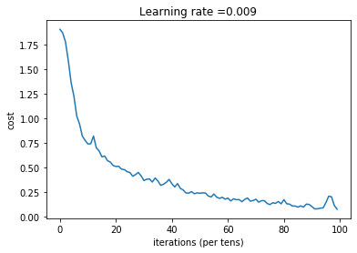

# Hand Sign recognition using CNN

The goal of this project is, given a hand sign image, predict the digit shown in image. The preview of image follows:

## Quick start:
clone or download the repository and run signs.py
> signs.py

 ## Outline
 1. create basic functions 
 2. build a model using basic function's 
 3. running the model to predict
 
 ### Basic functions:
 1. load data : using h5py module data is being loaded
 2. intitializing parameters : xavier intialisation
 3. create placeholder: useful during running of model 
 4. feed forward propagation:  CONV2D -> RELU -> MAXPOOL -> CONV2D -> RELU -> MAXPOOL -> FLATTEN -> FULLYCONNECTED (architecture of CNN)
 5. computing cost : softmax entropy loss 
 6. random mini batches : creates random  mini batches for training
 7. one hot vector : to convert the labels into categorial ( as shown in above image)
 
 ### Model :
  **input** : training data, testing data, learning rate, num epochs, mini batch size  
  
  **ouput**(after running the model) : training accuracy, testing accuracy, plot showing the cost function value after each epoch  
  
  ## Results:
  
  
 
Train Accuracy: 0.98333335  
Test Accuracy: 0.8833333

